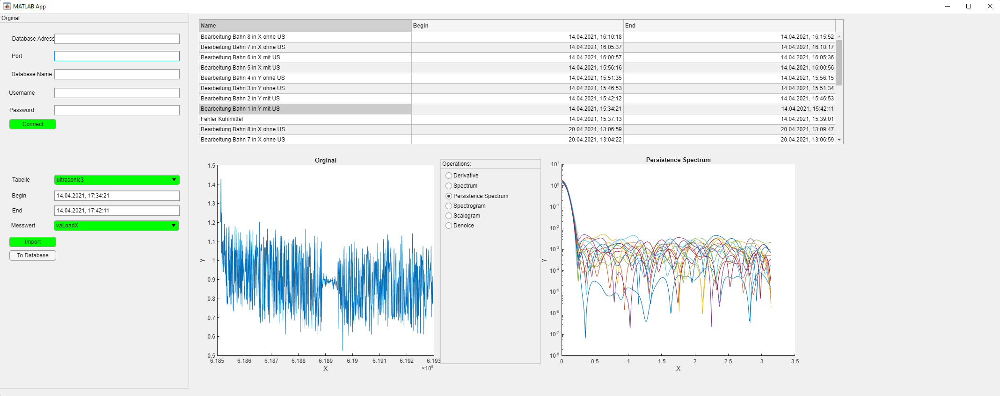
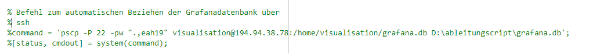
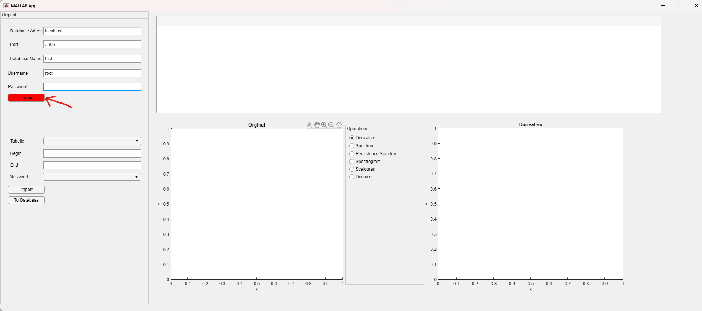
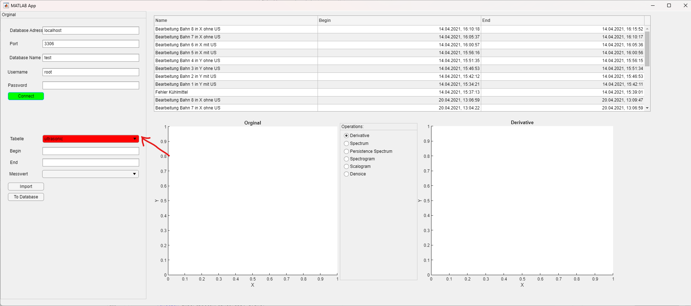
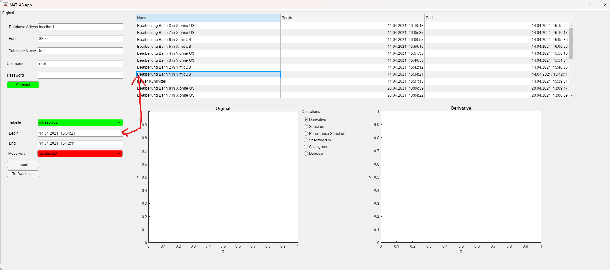
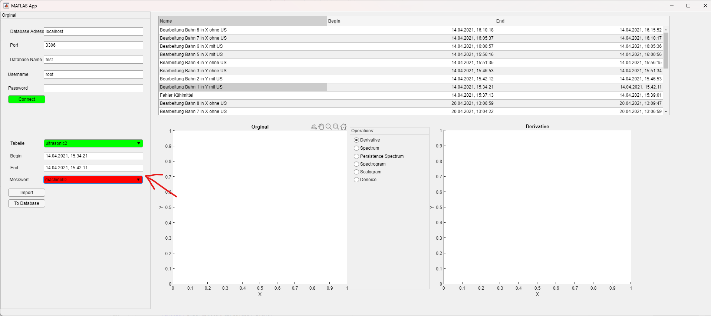
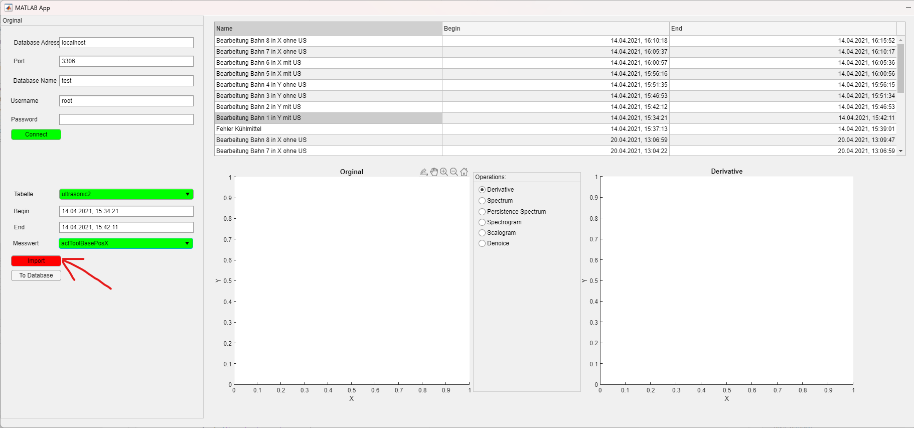
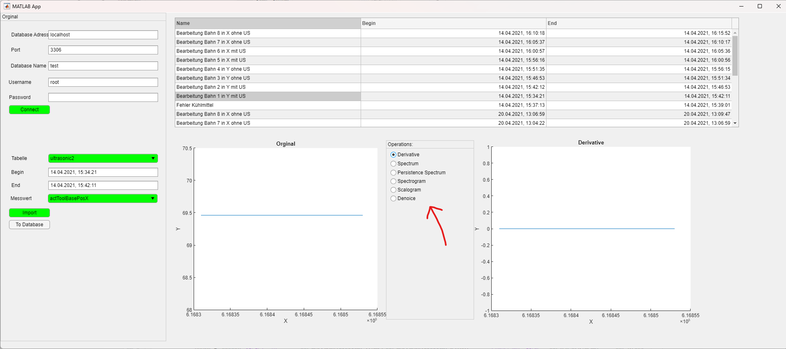

# Matlab Database Importer

Mit dem Matlab Database Importer lassen sich die Maschinendaten aus der Datenbank in Matlab importieren. Zusätzlich lassen sich Operationen wie z.B. die Ableitung des Graphen ausführen und zurück in die Datenbank schreiben.

## Matlab Toolbox
Um mit Matlab überhaupt Zugriff auf Datenbanken zu bekommen, muss die **Database Toolbox** installiert sein.

## MySQL Connector
Damit der Zugriff auf die Datenbank funktioniert, muss der [MySQL Connector](https://downloads.mysql.com/archives/c-j/) heruntergeladen werden. Die Datei muss entpackt und die **.jar**-Datei ins Verzeichnis der Matlab-App kopiert werden. Zusätzlich muss im Quellcode der Name des Connectors angepasst werden.
```
connectorFile = 'mysql-connector-java-8.0.21.jar';
```

## Grafana Datenbank
Will man die Annotationen von Grafana nutzen, muss die Grafana-Datenbank auf dem PC kopiert werden. Um diesen Vorgang zu automatisieren, wurden folgende Zeilen in die App aufgenommen:

Die zwei unteren Zeilen müssen dafür wieder einkommentiert werden.
Die IP und das Passwort sind nicht mehr aktuell und müssen vorher angepasst werden.

## Ablauf
### Verbindung mit der Datenbank herstellen
Zum Herstellen der Verbindung zur Datenbank müssen die Daten eingegeben werden und "Connect" betätigt werden.


### Auswahl der Tabelle
Die Maschinendaten sind in mehrere Sets geteilt und befinden sich auf verschiedenen Tabellen.


### Zeitfenster bestimmen
Um die Daten zu betrachten, muss ein Zeitfenster gewählt werden, das betrachtet werden soll.
Das kann sowohl manuell per Eingabe des Zeitstempels, als auch per Klick auf die Annotation ausgeführt werden.


### Auswahl des Messwertes
Man muss einen Messwert auswählen, der betrachtet werden soll. Es stehen nur die Messwerte der oben ausgewählten Tabelle zur Verfügung.


### Eingaben bestätigen
Um den Importvorgang der Daten zu starten, muss die "Import"-Schaltfläche betätigt werden.


### Auswahl der Funktion
Sind die Daten importiert, lassen sich verschiedene Bearbeitungsfunktionen ausführen.
