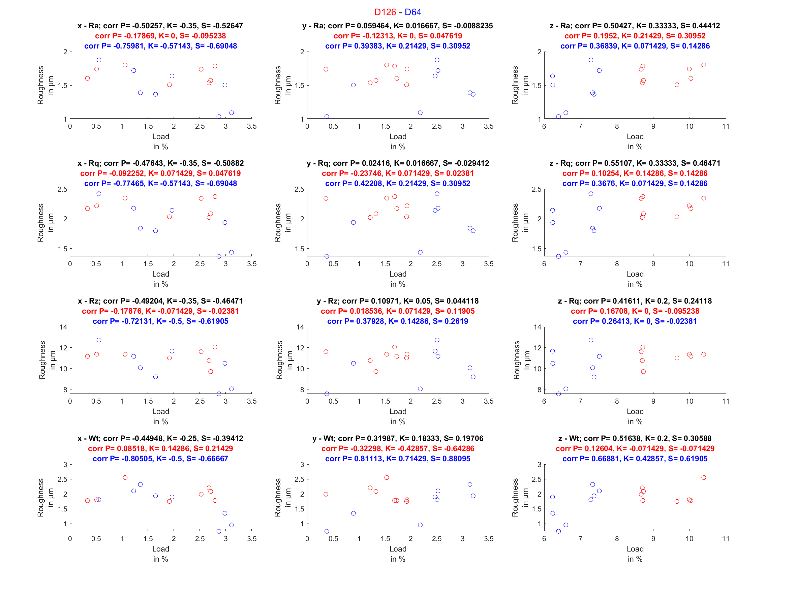

# both tools

Das Script im "Both Tools" erstellt Graphen für beide Werkzeuge, die per Farbe zu unterscheiden sind.

## config

Vor dem Ausführen des Scripts müssen die Parameter der Datenbank eingetragen werden.

## Rauheitswerte
Zusätzlich müssen die Rauheitswerte aus der "rauheiten.mat"-Datei ins Workspace geladen werden (In Matlab-Navigationsleiste die Schaltfläche "Open" auswählen und die "rauheiten.mat" im "dataset"-Ordner auswählen ).

## Speicherort festlegen
In der "printPlot_beide_versuche.m" kann in den letzten Zeilen (beginnend mit "saveas") der Pfad angegeben werden, wo die Dateien gespeichert werden sollen. 

## Ausführen
Im Reiter "Editor" die Run-Schaltfläche auswählen und warten. Es öffnen sich mehrere Plots, die im Anschluss wieder geschlossen werden können.